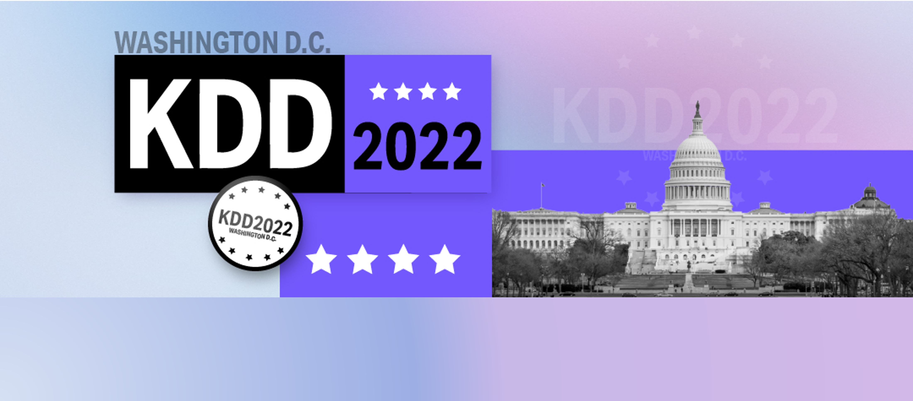
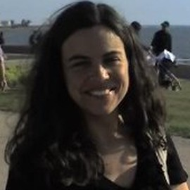
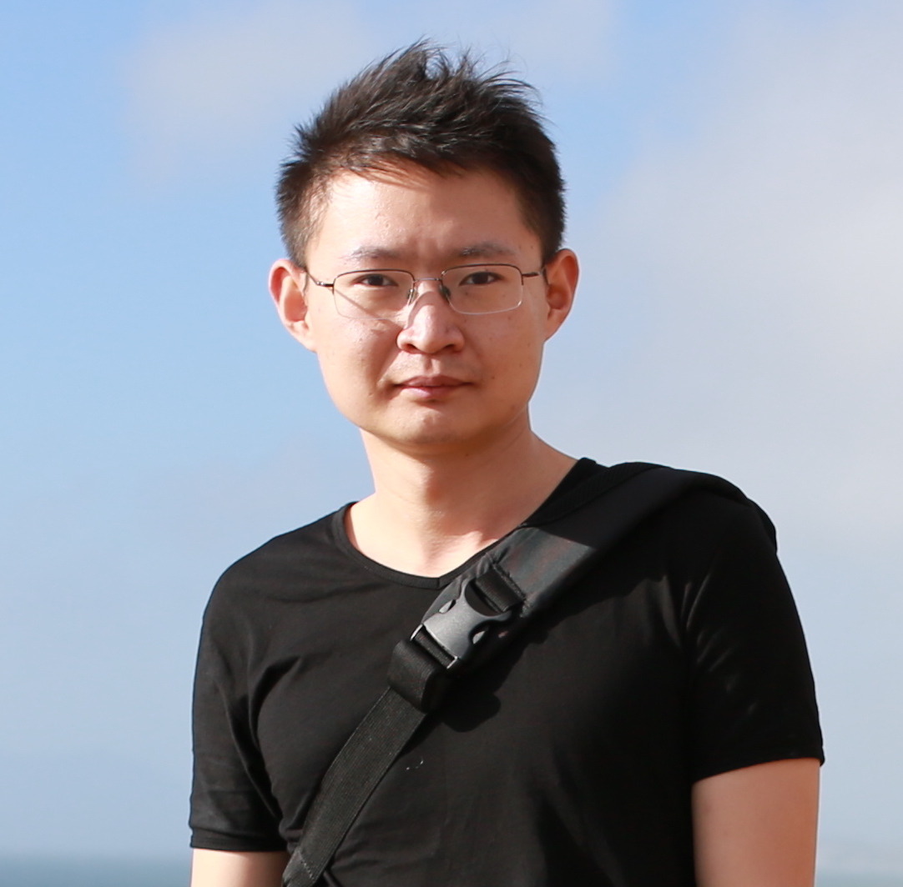

## DLP-KDD2022 Introduction

In the increasingly digitized world, applications in a wide varity of domains are shifting to harness the ability to process, understand, and exploit data collected from different sources. Deep learning-based methods, in particularly, have recently empowered many applications to leveraging their data. This incluses examples from customer-centric applications, such as personalized recommendations, online advertising, search engines and interest/intention modeling from customers’ behavior. In these applications, leveraging deep learning tools can significantly enhance the user's experience while increasing revenues. Data generated in customer-centric applications and other critical real-world domains such as health and medicine, biology, business, industrial engineering, _etc_ are often high-dimensional, sparse and imbalanced. These adverse data properties challenge the application of deep learning in real-world applications due to the fact that they can cause poor model performance, failed projects, and potentially serious social implications.

The complexities explored here are different from many traditional deep learning applications, such as image classification and speech recorgnition, which have rich, dense datasets for model development and testing. Typical prediction tasks related to click-through rates, for example, involve billions of sparse features. Thus, the question of how to mine, model and perform inference on such data is a challenging and interesting problem. The characteristics  of high-dimensional, sparse and imbalanced data pose unique challenges to the adoption of deep learning, and requires the community to re-assess the traditional methodologies and explore novel domain-specific approaches to learn and evaluate robust and trustworthy model. This workshop will provide a venue for researchers and practicioners to discuss challenges, opportunities, and new ideas related to the application of deep learning on high-dimensional, sparse, and imbalanced data. 

These challenges have been widely studied by the traditional machine learning and data mining community, and new techniques have been developed for deep learning. These include methods such as transfer learning, few-shot learning, meta-learning, active learning, data resampling, data generation and augmentation, one-class learning, domain decompositions, etc.. Through the course of this workshop, we will drill into the latest challenges and methodologies whilst reflecting on what the traditional machine learning and data mining researchers can contribute to the advancement of state-of-the-art in deep learning from high-dimensional, sparse, and imbalanced data with adverse properties. The workshop will bring together a diverse cross-section of speakers and a wide community of data mining and deep learning researchers and practitioners from academia, industry, and government.

## Important Dates

- Submission deadline:  May 26, 2022 23:59 anywhere on earth
- Acceptance notification: June 24 2022.
- Workshop date: August 14, 2022

  - Morning topics (8:00 am - 12:00 pm): High-dimensional and sparse data

  - Afternoon topics (12:40 pm - 5:15 pm): Imbalance and deep learning    

## Invited Speakers

### Morning session:

- TBA

### Afternoon session:

- **[Nitesh Chawla](https://niteshchawla.nd.edu):** Frank M. Freimann Professor of Computer Science & Engineering and Director of Lucy Family Institute for Data and Society at the University of Notre Dame

- **[Bartosz Krawczyk](http://www.egr.vcu.edu/directory/bartosz.krawczykphd/):** Assistant Professor of Computer Science, Virginia Commonwealth University, USA

- **[Mohak Shah](http://www.mohakshah.com):** CTO of Gauss Labs, San Fransisco, USA

## Workshop Schedule 

|       Time (EST)             | Event                             |
|------------------------------|-----------------------------------|
|        **Morning session**   |                                   |
|8:00 am - 12:00 pm            |	TBA                              |
|        **Afternoon session** |                                   |
|12:40 pm - 1:00 pm            |	Welcome and Introduction         |
|1:00 pm - 1:40 pm	           |	Keynote 1: Bartosz Krawczyk      | 
|1:40 pm - 2:40 pm	           |	Paper Session (4 Paper Talks)    |
|2:40 pm - 3:20 pm	           |	Break + Poster Session (9 papers)|
|3:20 pm - 4:00 pm	           |	Keynote 2: Mohak Shah            |
|4:00 pm - 4:40 pm	           |	Keynote 3: Nitesh Chawla         |
|4:40 pm - 5:10 pm	           |	Panel Discussion (Round Table)   |
|5:10 pm - 5:15 pm	           |	Closing                          |

## Topics of Interest
<!-- Topics include but are not limited to topics related to deep learning with high-dimensional, sparse and imbalanced data, large scale deep learning training framework, high-performance online inference engine or toolkits that help breaking the black box of deep learning models, such as -->
The topics of interest include, but are not limited to, the following:
- Challenges and Risks of deep learning from high-dimensional, sparse, and imbalanced data
- Large scale user response prediction modeling
- Representation learning for high-dimensional, sparse, and imbalanced data
- Multi-domain generalization through few-shot learning and zero-shot learning
- Embedding techniques, manifold learning and dictionary learning
- Scalable, distributed and parallel training system for deep learning
- High-throughput and low-latency real-time serving systems
- Applications of transfer learning and meta-learning for high-dimensional, sparse, and imbalanced data
- Understanding user behavior
- Large-scale recommendation and retrieval systems
- Model compression for industrial applications 
- Auto-machine learning, auto-feature selection
- Explainable deep learning for high-dimensional, sparse, and imbalanced data
- Data augmentation and anomaly detection for high-dimensional, sparse, and imbalanced data
- Generative Adversarial Networks for high-dimensional, sparse, and imbalanced data
- Leveraging insights from traditional machine learning and data mining approaches for deep learning with high-dimensional, sparse, and imbalanced data
- Moral and social issues related to the applications of models trained on high-dimensional, sparse, and imbalanced data
- Other challenges encountered in real-world applications

## Accepted Papers

### Morning Session

- TBA

### Afternoon Session

- Paper 4:	**Unsupervised Cross-Domain Conditional Generation via Normalizing Flows and Adversarial Training**	[Paper](accepted_papers/dlp-kdd2022_paper4.pdf). Hari Prasanna Das, UC Berkeley; Ryan Tran, UC Berkeley; Japjot Singh, UC Berkeley; Yu Wen Lin, UC Berkeley; Costas J. Spanos, UC Berkeley.

- Paper 5:	**Conditional Synthetic Data Generation for Personal Thermal Comfort Models** [Paper](accepted_papers/dlp-kdd2022_paper5.pdf). Hari Prasanna Das, UC Berkeley; Costas J. Spanos, UC Berkeley.

- Paper 7:	**CNN Algorithms for Standoff Detection of Trace Explosives** [Paper](accepted_papers/dlp-kdd2022_paper7.pdf). Eric Yao, Naval Research Laboratory.

- Paper 12:	**De-biasing training data distribution using targeted data enrichment techniques**	[Paper](accepted_papers/dlp-kdd2022_paper12).pdf). Dieu Thu Le, Amazon; Jose Garrido Ramas, Alexa AI; Yulia Grishina, Amazon; Kay Rottmann, Alexa AI.

- Paper 13:	**Self-supervised Learning for Hyperspectral Images of Trees** [Paper](accepted_papers/dlp-kdd2022_paper13). Moqsadur Rahman, University of Texas at El Paso; Saurav Kumar, Arizona State University; Santosh Subhash Palmate, Texas A&M University; M. Shahriar Hossain, University of Texas at El Paso.

- Paper 15:	**Ask Me What You Need: Product Retrieval using Knowledge from GPT-3** [Paper](accepted_papers/dlp-kdd2022_paper15). Su Young Kim, Clova AI Research, NAVER Corp.; Hyeonjin Park, Korea university; Kyuyong Shin, NAVER AI Lab, NAVER Corp.; Kyung-Min Kim, Clova AI Research, NAVER Corp..

- Paper 22:	**Towards an Efficient ML System: Unveiling a Trade-off between Task Accuracy and Engineering Efficiency in a Large-scale Car Sharing Platform** [Paper](accepted_papers/dlp-kdd2022_paper22). Kyung Ho Park, SOCAR AI Research; Hyunhee Chung, SOCAR; Soonwoo Kwon, Socar.

- Paper 23:	**DynInt: Dynamic Interaction Modeling for Large-scale Click-Through Rate Prediction**	[Paper](accepted_papers/dlp-kdd2022_paper23). YACHEN YAN, Credit Karma; Liubo Li, Credit Karma.

- Paper 26:	**DHEN: A Deep and Hierarchical Ensemble Network for Large-Scale Click-Through Rate Prediction** [Paper](accepted_papers/dlp-kdd2022_paper26). Buyun Zhang, Meta; Liang Luo, University of Washington; Xi Liu, Meta Platforms, Inc.; Jay Li, Meta; Zeliang Chen, Facebook, Inc.; Weilin Zhang, Meta Platforms, Inc.; Xiaohan Wei, Facebook; Yuchen Hao, Meta; Michael Y Tsang, Meta Platforms, Inc.; Wenjun Wang, Meta; Yang Liu, Meta Platform Inc.; Mengyue Hang, Meta; Renqin Cai, Meta; Chaofei Yang, Meta.; Yiqun Liu, Facebook; Sihan Zeng, Meta; Rui Zhang, Meta; Xiaocong Du, Meta; Huayu Li, Meta; Yasmine Badr, Meta Platforms; Jongsoo Park, Facebook, Inc.; Jiyan Yang, Facebook Inc.; Dheevatsa Mudigere, Facebook; Ellie Wen, Facebook.

## Key Dates and Author Instructions

Please format your papers using the standard KDD 2022 style files. Submissions must be in PDF format and formatted according to the new [Standard ACM Conference Proceedings Template](https://www.acm.org/publications/proceedings-template).

In addition to full-length papers (up to 9 pages) describing clear research advances, we encourage the submission of short papers (2-4 pages) that discuss work in progress, new challenges and limitations, and future directions for representations learning to overcome limited and adverse data, along with socially relevant problems, ethical AI and AI safety.

Submissions should be anonymized. 

## Submission System
<a href="https://cmt3.research.microsoft.com/DLPKDD2022/">https://cmt3.research.microsoft.com/DLPKDD2022/</a>

## Selection Criteria

All submissions will undergo peer review by the workshop’s program committee. Accepted papers will be chosen based on technical merit, empirical validation, novelty, and suitability to the workshop’s goals.

The workshop aims to provide an engaging platform for dialog that will push the state-of-the-art in deep learning from high-dimensional, sparse, and imbalanced data. To this end, selected papers will include long papers, short works-in-progress, novel topics and future directions. Work that has already appeared or is scheduled to appear in a journal, workshop, or conference (including KDD 2022) must be significantly extended to be eligible for workshop submission. Work that is currently under review at another venue may be submitted.

If you have any questions about submissions or our workshop, please contact [*dlpkdd2022@hotmail.com*](mailto:dlpkdd2022@hotmail.com)

## Previous Editions

Website for dlp-kdd2021 can be found **[<b style="color:red"> here </b>](https://dlp-kdd.github.io/)**

Website for s2d-olad2021 can be found **[<b style="color:red"> here </b>](https://s2d-olad.github.io/)**

## SIGKDD 2022 Information

   
  
 See the SIGKDD 2022 website for more details on the workshop location and times, along with the full schedule and list of invited speakers.

  
 

  
 

 
 

## Workshop Chairs

   
  <a href="https://www.american.edu/cas/faculty/rcorizzo.cfm">Roberto Corizzo</a>
  
Assistant Professor

  
American University, Washington D.C., USA

  
rcorizzo@american.edu

   
  <a href="">Junfeng Ge</a>
  
Senior staff algorithm engineer

  
Alibaba Group

  

    

   
  <a href="https://web.cs.dal.ca/~bellinger/">Colin Bellinger</a>
  
AI Researcher

  
National Research Council of Canada

  
colin.bellinger@nrc-cnrc.gc.ca

   
  <a href="https://scholar.google.com/citations?user=eUMnOc0AAAAJ&amp;hl=en">Xiaoqiang Zhu</a>
  
Chief AI Officer

  
Mobvista Group

  

   
  <a href="hhttps://paobranco.github.io">Paula Branco</a>
  
Assistant Professor

  
University of Ottawa, Ottawa, Canada

  
pbranco@uottawa.ca

  

   
   <a href="https://scholar.google.com/citations?user=r9JOIloAAAAJ">Kuang-chih Lee</a>
  
Tech Lead of business intelligence group, AliExpress

  

  

   
  <a href="https://www.american.edu/cas/faculty/japkowic.cfm">Nathalie Japkowicz</a>
  
Professor

  
American University, Washington D.C., USA

  
japkowic@american.edu

   
  <a href="https://scholar.google.com/citations?user=fUtHww0AAAAJ&amp;hl=en">Ruiming Tang</a>
  
Director of recommendation and search

  
Huawei Noah Ark Lab

  

   
  <a href="https://scholar.google.com/citations?user=mXN0KTIAAAAJ">Tao Zhuang</a>
  
 Senior staff engineer

  
 Alibaba Group

  

   
  <a href="https://scholar.google.com/citations?user=kAT8BcIAAAAJ">Han Zhu</a>
  
Staff Engineer

  
Alibaba Group

  

  

   
  <a href="http://byeah.github.io">Biye Jiang</a>
  
Staff Engineer

  
Alibaba Group

   
  <a href="https://scholar.google.com/citations?user=DDXcKKcAAAAJ">Jiaxin Mao</a>
  
Assistant Professor

  
Renmin University of China

  

   
  <a href="http://wnzhang.net">Weinan Zhang</a>
  
Associate Professor

  
Shanghai Jiao Tong University

  

  

## Program Committee
Abhishek Gupta,	UC Berkeley			

Alberto Cano,	Virginia Commonwealth University			

Bartosz Krawczyk,	Virginia Commonwealth University			

Constantine Dovrolis,	Georgia Tech			

Denis Gudovskiy,	Panasonic			

Dino Ienco,	IRSTEA			

Eftim Zdravevski,	Faculty of Computer Science and Engineering	 Ss Cyril and Methodius University	 Skopje	 North Macedonia

Evan Crothers,	University of Ottawa			

Gianvito Pio,	University of Bari			

Herna Viktor,	University of Ottawa			

James Smith,	Georgia Institute of Technology			

Jeffrey Ling				

Jie Gao,	Rutgers University			

Joao Gama,	INESC TEC - LIAAD			

Massimiliano Altieri,	University of Bari			

Michal Wozniak,	Wroclaw University of Science and Technology		

Michelangelo, Ceci	University of Bari			

Mikel Galar,	Universidad Pública de Navarra			

Nuno Moniz,	INESC TEC & University of Porto	 Portugal		

Rita Ribeiro,	Porto	 Portugal		

Roberto Alejo,	Tecnologico de Estudios Superiores de Jocotitlan			

Ronaldo Prati,	UFABC		

Salvador García,	Universidad de Granada			

Taghi Khoshgaftaar,	Florida Atlantic University	 USA		

Tailin Wu,	MIT			

Zois Boukouvalas,	American University			

Zsolt Kira,	Georgia Institute of Technology			

## Sponsor
To be defined. 
